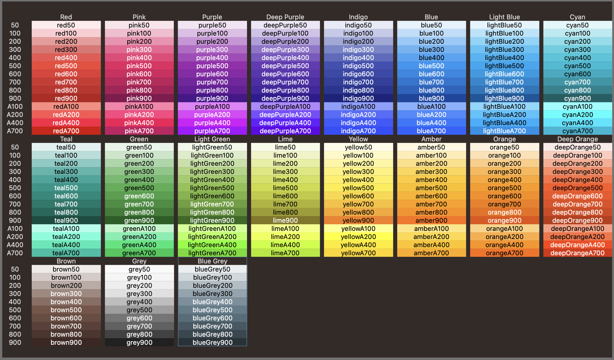

# Material Design Colors by Google
SwiftUI-Version


  

---

# [나무위키 > 머터리얼 > 컬러 팔레트](https://namu.wiki/w/%EB%A8%B8%ED%8B%B0%EB%A6%AC%EC%96%BC%20%EB%94%94%EC%9E%90%EC%9D%B8#toc)

## Material palette Color Tool
* [COLOR TOOL](https://m2.material.io/resources/color/#!/?view.left=0&view.right=0)  
  

## Xcode Preview
  

## Example 1
```swift
import MaterialDesignColor

let color: Color = .pink400
```

## Example 2
```swift
import MaterialDesignColor

Text("title")
  .foregroundColor(.tealA700)
```

## Installation
### Swift Package Manager

The [Swift Package Manager](https://swift.org/package-manager/) is a tool for automating the distribution of Swift code and is integrated into the `swift` compiler. 

Once you have your Swift package set up, adding Alamofire as a dependency is as easy as adding it to the `dependencies` value of your `Package.swift`.

```swift
dependencies: [
    .package(url: "https://github.com/swift-man/MaterialDesignColor.git", .upToNextMajor(from: "1.0.0"))
]
```
